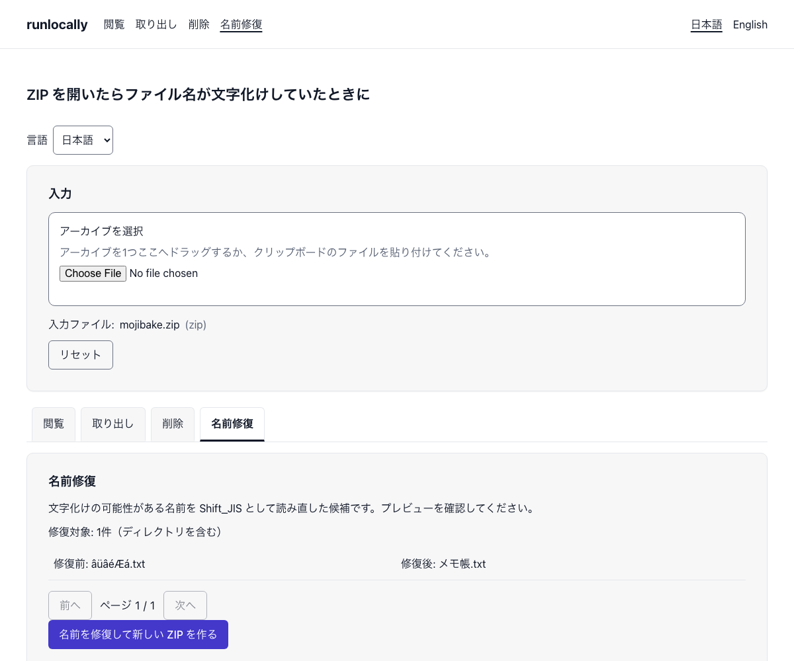

# runlocally

## 日本語

**ZIP ワークベンチ**は、ブラウザ内でアーカイブを閲覧・取り出し、ZIP を再構築するアプリです。ファイルをアップロードせずに使えるよう開発中です。

### v0.1.0 の対応範囲

- ZIP／RAR／7z／tar の一覧閲覧と、ZIP の非暗号化ファイルおよび読み取れる RAR／7z／tar の個別・一括取り出し。
- ZIP の選択項目を除外した新しい ZIP の生成。元の入力は変更しません。
- ZIP の名前を Shift_JIS として読み直した候補のプレビューと反映。正しい文字コードへの復元は保証せず、同名衝突時は実行しません。

暗号化 ZIP 項目の取り出しは提供していません。一括取り出しでは暗号化項目を除外します。削除・名前修復で暗号化項目を残すと再構築は失敗します。入力は 1,000,000,000 bytes 以下ですが、上限以内でも処理成功は保証しません。作成・分割・結合・破損 ZIP の復旧・暗号解除・暗号化の操作画面は未提供です。名前修復は破損 ZIP の内容の復旧ではありません。画面は gzip ヘッダ単独の tar.gz を識別しません。詳しくは [変更履歴](CHANGELOG.md) を参照してください。

### スクリーンショット



実際の画面です（加工なし）。ファイル名が文字化けした ZIP を入れ、名前修復で候補を確認しているところです。

### 4 つの公約

1. クライアントからの追加送信なし — DevTools の Network タブで確認できます。
2. オフラインで動作する — DevTools の Offline モードで確認できます。
3. PWA としてインストール可能 — ブラウザのインストール導線と DevTools の Application → Manifest で確認できます。
4. 脆弱性報告経路を維持する — [SECURITY.md](SECURITY.md) と GitHub Private Vulnerability Reporting で確認できます。

正確な文言は [原則](docs/PRINCIPLES.md) を参照してください。Service Worker は初回の事前保存完了後に公開中の12ページ（ハブ2ページと ZIP 10ページ）と操作資産をオフラインで提供します。対応ブラウザではインストール案内が表示されます。実際のオフライン操作とインストールは実機確認が必要です。画面の状態と操作は [UI 文書](docs/UI.md) を参照してください。

| ページ | 日本語 | 英語 |
| --- | --- | --- |
| ハブ | `/` | `/en/` |
| ZIP top | `/zip/` | `/en/zip/` |
| 閲覧 | `/zip/view/` | `/en/zip/view/` |
| 取り出し | `/zip/extract/` | `/en/zip/extract/` |
| 削除 | `/zip/remove/` | `/en/zip/remove/` |
| 名前修復 | `/zip/fix-names/` | `/en/zip/fix-names/` |

各ハブには同じ言語の ZIP top へ進むカードがあります。Workbench は ZIP ページだけに載ります。ZIP 内の操作・言語切替では現在の File と処理結果を保持しますが、ハブへの通常遷移と再読込では保持しません。旧操作 URL は410を返し、新 URL へ301転送しません。言語とページの追加手順は [I18N 文書](docs/I18N.md) を参照してください。Service Worker・更新・ヘッダ・旧 URL の仕組みは [PWA 文書](docs/PWA.md) を参照してください。公約と自動検証の対応、検証の限界、実ブラウザ確認の手順は [公約の検証](docs/COVENANTS.md) を参照してください。

### 開発

Node.js 24 以上が必要です。依存の導入後は以下を実行します。

```sh
npm ci
npm run dev
npm run ci
```

単体テストは `npm run test:unit -- --coverage`、部品テストは `npm run test:component` で実行します。Vitest は単体テストを Node、部品テストを jsdom で実行し、両方を CI で収集します。[部品の契約](src/ui/README.md)も参照してください。エンジンの coverage 閾値は lines・functions・statements が 80%、branches が 75% です。`npm run check:engine-dom` はエンジン内の DOM 参照を検査します。公開 API と終了責任は [エンジン文書](docs/ENGINE.md) を参照してください。第三者帰属は解析用ビルドの sourcemap と静的コピー対象から配布コードを特定し、`npm run notice:generate` で [NOTICE](NOTICE.md) を再生成、`npm run notice:check` で一致を検査します。これらの検査と `npm run check:egress` は `npm run ci` に含まれます。e2e は先にビルドし、別ステップで `npm run test:e2e` を実行します。ローカル e2e の配信には Wrangler Pages を使います。

セルフホスト用 Docker は v0.4.0 で提供予定です。

ライセンス: [MIT](LICENSE)。

Colophon: Some code was written with AI assistance; all review and decisions are the maintainer's.

## English

**ZIP Workbench** lets you browse and extract archives and rebuild ZIP files in the browser. It is being developed for use without uploading files.

### v0.1.0 scope

- Browse ZIP, RAR, 7z, and tar entries. Extract unencrypted ZIP files and readable RAR, 7z, and tar entries individually or in a batch.
- Generate a new ZIP that excludes selected ZIP entries. The original input is unchanged.
- Preview and apply ZIP name candidates by rereading names as Shift_JIS. Correct encoding is not guaranteed, and a name collision prevents the operation.

Encrypted ZIP entries cannot be extracted; batch extraction skips them. Removal and name repair fail if encrypted entries remain in the rebuilt ZIP. Inputs are limited to 1,000,000,000 bytes, and an input within that limit may still fail. The interface does not offer creation, splitting, merging, damaged ZIP recovery, decryption, or encryption. Name repair does not recover the contents of a damaged ZIP. The interface does not recognize tar.gz from a gzip header alone. See the [changelog](CHANGELOG.md) for the operation list and limits.

### Screenshot


The actual screen, unedited: a ZIP with garbled file names has been added and the name repair candidates are being reviewed.

The four promises are no additional client requests, offline use, PWA installation and a maintained vulnerability reporting path. Check them through DevTools Network, DevTools Offline, the browser install prompt and DevTools Application → Manifest, and [SECURITY.md](SECURITY.md) with Private Vulnerability Reporting, respectively. See the exact wording in [Principles](docs/PRINCIPLES.md). After initial precaching completes, the Service Worker serves the twelve public pages (two hubs and ten ZIP pages) and operation assets offline. Supported browsers can show an install prompt. Offline operations and installation still need device verification. See [Covenant verification](docs/COVENANTS.md) for the automated checks, their limits, and device verification steps.

| Page | Japanese | English |
| --- | --- | --- |
| Hub | `/` | `/en/` |
| ZIP top | `/zip/` | `/en/zip/` |
| Browse | `/zip/view/` | `/en/zip/view/` |
| Extract | `/zip/extract/` | `/en/zip/extract/` |
| Remove | `/zip/remove/` | `/en/zip/remove/` |
| Fix names | `/zip/fix-names/` | `/en/zip/fix-names/` |

Each hub has a card linking to ZIP top in the same language. Only ZIP pages mount the Workbench. Switching operations or languages within ZIP keeps the current File and results; ordinary navigation to a hub and reloading start a new session. Old operation URLs return 410 rather than redirecting to the new URLs with 301. See [UI behavior](docs/UI.md) for state and [I18N](docs/I18N.md) for adding languages and pages. How the service worker, updates, headers and old URLs work is described in [PWA](docs/PWA.md).

Development requires Node.js 24 or newer: run `npm ci`, `npm run dev` and `npm run ci`. Self-hosting with Docker is planned for v0.4.0. License: [MIT](LICENSE).

Run unit tests with `npm run test:unit -- --coverage` and component tests with `npm run test:component`. Vitest runs unit tests in Node and component tests in jsdom; CI collects both. See the [component contract](src/ui/README.md). Engine coverage thresholds are 80% for lines, functions and statements, and 75% for branches. `npm run check:engine-dom` checks for DOM references in the engine. See the [engine API](docs/ENGINE.md) for signatures and cleanup responsibilities. The notice generator identifies browser-delivered code from analysis-build sourcemaps and statically copied assets. Regenerate [NOTICE](NOTICE.md) with `npm run notice:generate` and verify it with `npm run notice:check`. These checks and `npm run check:egress` are part of `npm run ci`. Build first, then run `npm run test:e2e` as a separate step. Local e2e uses Wrangler Pages.
